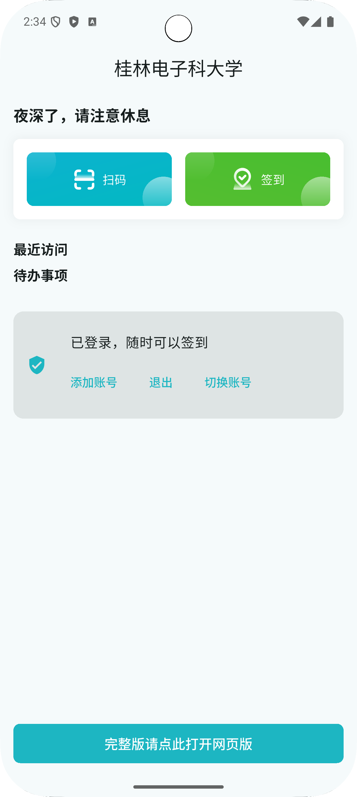
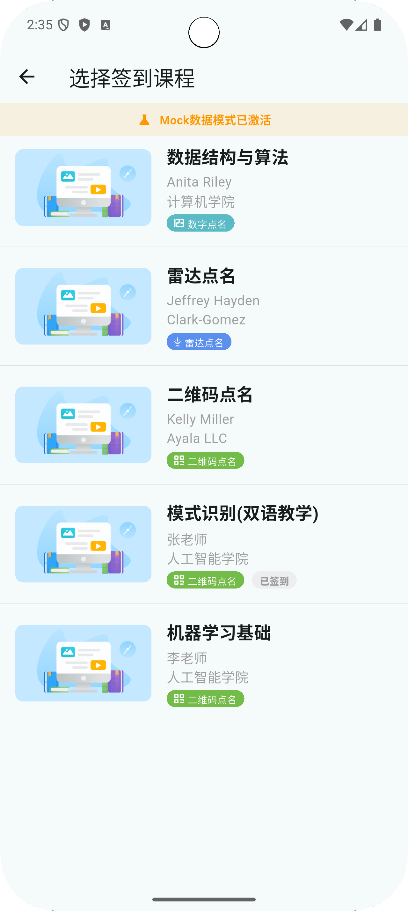
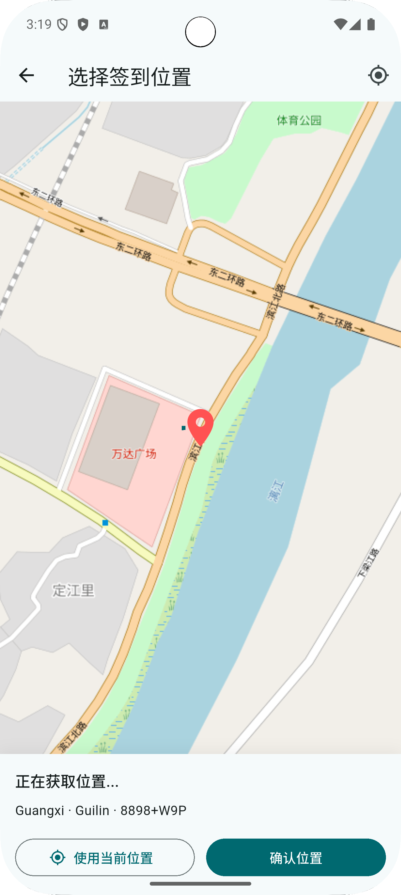
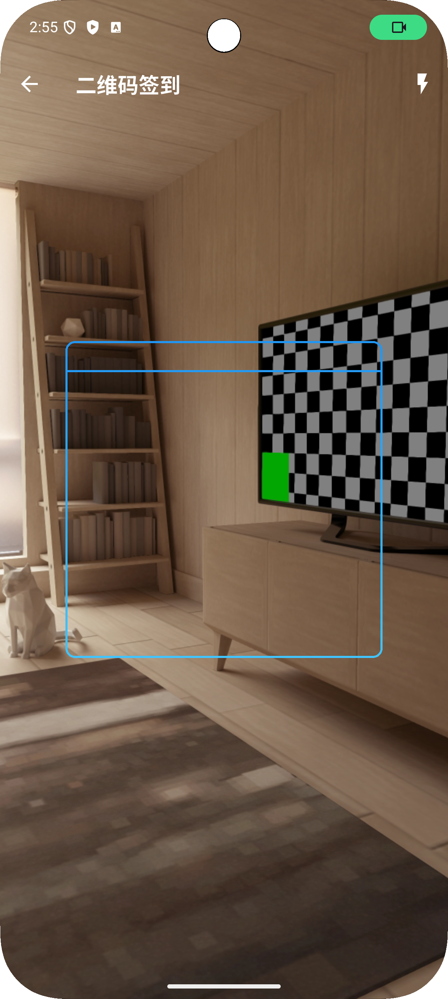
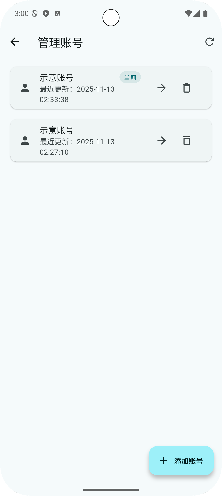

# TronClass Plus

TronClass Plus 是面向桂电同学的非官方 Tronclass 客户端，主打签到、雷达点名、二维码签到等场景，同时提供多账号、Web
门户和地图定位等工具，支持 Android / iOS / macOS / Windows / Web。

## 核心功能

- **多账号管理**：登录信息加密存储，快速切换、删除、添加账号，登录页也可直接管理账号。
- **雷达点名助手**：动画反馈、状态提示，一键重试，异常信息清晰可见。
- **地图定位**：基于 OpenStreetMap 的地点选择器，支持逆地理编码、WGS84 ➜ GCJ-02 自动转换。
- **Tronclass Web 入口**：内置 WebView 同步 Cookie、验证码弹窗、桌面/移动 UA 切换、缓存清理。
- **二维码 / 数字签到**：独立页面快速扫码或填码，配合 ChangkeClient 完成后台请求。

## 已知问题 / 兼容性提示

- **Release 模式的二维码扫描必须使用非 `Positioned` 的 overlay**：`MobileScanner.overlayBuilder` 若直接返回 `Positioned`（父节点不是 `Stack`），Debug 模式只发出警告，但 Release 会抛出 `type 'ParentData' is not a subtype of type 'StackParentData'` 并导致相机预览灰屏。现已改为 `Center` 包裹的自定义扫描框；调整 overlay 时务必保持这一约束。
- **消息提示**：丰富的 Toast 成功/失败提示与本地化文案。

## 下载
[https://github.com/wilinz/tronclass_puls/releases](https://github.com/wilinz/tronclass_puls/releases)

## 开发

1. 安装 Flutter 3.35.0+（建议使用 fvm 管理）
2. 执行 `flutter pub get` 拉取依赖
3. 根据目标平台运行：`flutter run -d android` / `-d ios` / `-d macos` / `-d windows` / `-d chrome`
4. 如需地图或 Web 功能，请确认本地网络可访问对应服务（中国大陆地区可能需要科学上网）

## 依赖栈

- Flutter + GetX 状态管理
- webview_flutter / flutter_map / geolocator / geocoding
- encrypt + get_storage 密钥存储
- dio, share_plus, permission_handler 等常用插件

## TODO

1. 抽象学校层：提供统一登录接口或 WebView 适配层，降低适配其他学校的成本。

## 截图

| TronClass Portal                                    | Rollcall List                                          |
|-----------------------------------------------------|--------------------------------------------------------|
|  |  |
| Map Picker                                          | Number Rollcall                                        |
|    |    |
| QR Rollcall                                         | Account Manager                                        |
|  |        |

------

## English

TronClass Plus is an unofficial Flutter client that streamlines everyday campus tasks for Guangxi
University of Electronic Technology students. It focuses on fast sign-ins, radar rollcalls, QR
check-ins, and a polished multi-account experience across Android, iOS, macOS, Windows, and the web.

## Key Features

- **Secure Login & Multi-Account Switcher** – GetX-based authentication with encrypted credential
  vault, quick user switching, and login history management.
- **Radar Rollcall Assistant** – Visual radar animation with retry guidance and backend status
  tracking.
- **Interactive Map Picker** – Choose rollcall coordinates on OpenStreetMap tiles, reverse-geocode
  addresses, and automatically convert WGS84 ➜ GCJ-02 before submission.
- **Tronclass Web Portal** – Built-in WebView (webview_flutter) with cookie sync, captcha handling,
  user-agent switching, and cache cleaning.
- **QR & Number Rollcalls** – Dedicated workflows for fast classroom check-ins, including scanning
  and manual code entry.
- **Toast & Notification Helpers** – Custom toast utility, localized messaging, and graceful error
  states.

## Getting Started

1. **Environment** – Install Flutter 3.35.0+ with fvm (`fvm install 3.35.0`).
2. **Dependencies** – `flutter pub get`
3. **Platform Setup**
    - Android: `flutter run -d android`
    - iOS: `cd ios && pod install && cd ..`
    - Desktop/Web: `flutter run -d macos` / `-d windows` / `-d chrome`
4. **Config** – Ensure `assets/` and `fonts/` listed in `pubspec.yaml` are kept in sync when adding
   images or localization files.

## Project Structure

```
lib/
├── auth/              # Login page, controller, saved account storage
├── data/              # Changke client, dio services, storage setup
├── tronclass/         # Feature pages (radar, QR, rollcalls, home)
├── utils/             # Coordinate transforms, helpers
└── webview/           # Custom WebView wrapper with cookies and captcha support
```

## Tech Stack

- **Flutter + GetX** for reactive state and navigation
- **webview_flutter** for the embedded Tronclass portal
- **flutter_map + geolocator + geocoding** for selecting and reverse-geocoding locations
- **encrypt + get_storage** for secure multi-account storage
- **share_plus, permission_handler, dio** for platform capabilities and networking

------

欢迎 Issue / PR 交流改进，祝使用愉快!
